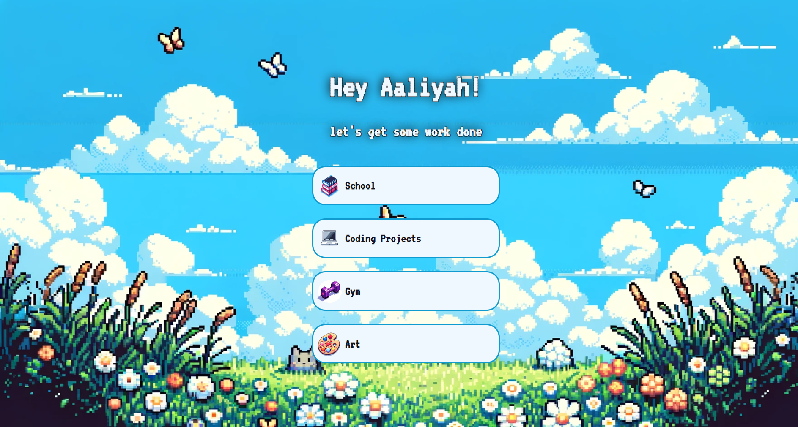
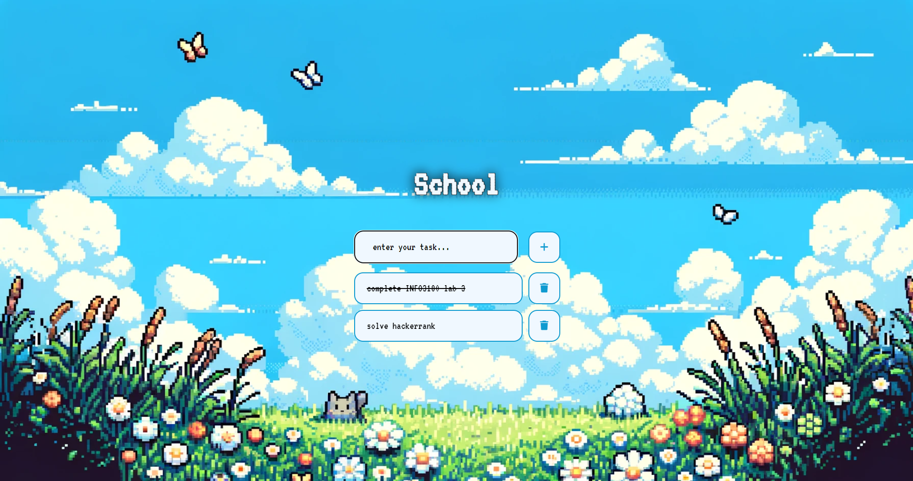

# To-Do-List App

A simple and intuitive to-do list application to help you manage your tasks efficiently.

## Description

This project is a to-do list application built using HTML, CSS, and JavaScript. It allows users to create, manage, and organize their tasks into different categories.

## Features

- Add new tasks
- Mark tasks as complete/incomplete
- Delete tasks
- Categorize tasks
- Responsive design

## Screenshots

### Categories View

### Task List View

